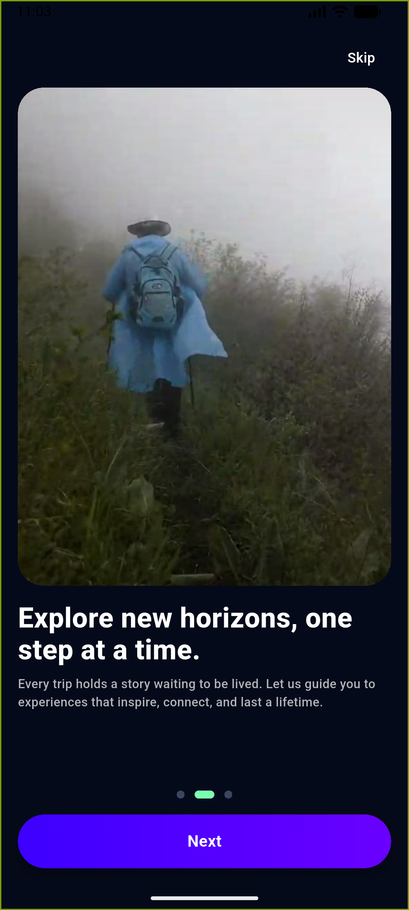
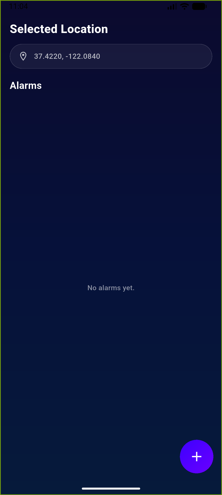
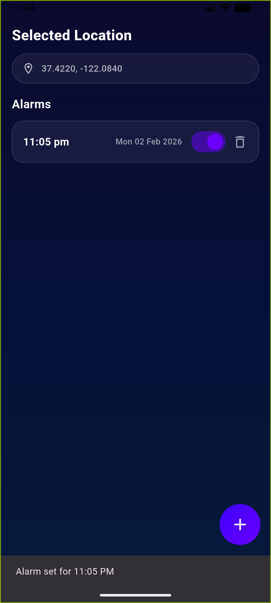

# Nature Onboarding Alarm App 🌿⏰

A Flutter-based travel alarm application featuring video onboarding, background music, location access, and smart alarm scheduling. The app is designed with a modern UI and focuses on smooth user experience and clean architecture.

---

## ✨ Features

- 🎬 Video-based onboarding (different video per screen)
- 🎵 Background music during onboarding
- 📍 Location permission & current location detection
- ⏰ Add, enable, disable, and delete alarms
- 🔔 Local notifications for alarms
- 🎨 Modern UI with gradients and rounded components
- 🚀 Optimized for performance and stability

---

## 🧰 Tools & Packages Used

### 🛠️ Development Tools
- Flutter SDK
- Dart
- Android Studio (Emulator / Build tools)
- VS Code
- Git & GitHub

### 📦 Flutter Packages
- `video_player` – Video onboarding screens
- `audioplayers` – Background music playback
- `geolocator` – Current device location
- `permission_handler` – Runtime permission handling
- `flutter_local_notifications` – Local alarm notifications
- `timezone` – Accurate scheduling with time zones
- `intl` – Date/time formatting
- `provider` – State management
- `shared_preferences` – Lightweight local storage (optional)

---

## 📸 Screenshots

> Here is the ultimate Output......

| Onboarding Page1 | Onboarding Page2 | Onboarding Page3 |
|---|---|---|
|  |  |  |

| Location | Alarms Page1 | Alarms Page2 |
|---|---|---|
|  |  |  |

## 🎥 Demo Video

Click the link below to watch the full app walkthrough:

🔗 **[Watch Demo Video](https://1drv.ms/v/c/7d38979e3c8ae0cc/IQCh96VUk75eQ4DCGYYooYQUAWQi0prd9KItinNUDZgt42M?e=wWtnbG)**  

## 📱 App Flow

1. Video onboarding with background music
2. Location permission screen
3. Home alarm screen
4. Add alarm using time picker
5. Receive scheduled notification

## ⚠️ Notes

1. Exact alarms may not trigger on some Android emulators due to system limitations.
2. The app works correctly on real Android devices.
3. Background music and video playback are optimized to prevent emulator crashes.